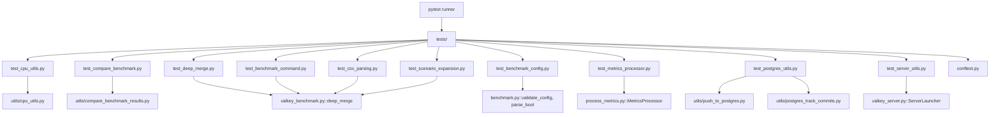

# Design Document: Test Suite Setup

## Overview

This design adds a comprehensive test suite to the valkey-perf-benchmark repository using pytest and Hypothesis. The test suite targets pure logic functions across the codebase — parsing, validation, statistical calculations, dictionary merging, metrics processing, command building, and config subset detection — without requiring external services or infrastructure.

The testing strategy uses a dual approach:
- **Unit tests** for specific examples, edge cases, and error conditions
- **Property-based tests** (via Hypothesis) for universal properties that should hold across all valid inputs

## Architecture



## Components and Interfaces

### Test Infrastructure

**conftest.py** — Shared fixtures and test configuration:
- `sys.path` manipulation to allow imports from the repo root (since the project has no `setup.py` or package structure)
- Shared fixtures for common test data (valid configs, benchmark data samples)

**pytest.ini / pyproject.toml** — Test runner configuration:
- Test discovery paths (`tests/`)
- Hypothesis settings (max examples = 100 minimum per property)

### Test Modules

Each test module maps to one or more source modules:

| Test Module | Source Module(s) | Test Type |
|---|---|---|
| `test_cpu_utils.py` | `utils/cpu_utils.py` | Unit + Property |
| `test_compare_benchmark.py` | `utils/compare_benchmark_results.py` | Unit + Property |
| `test_deep_merge.py` | `valkey_benchmark.py` (deep_merge) | Unit + Property |
| `test_benchmark_config.py` | `benchmark.py` (validate_config, parse_bool, validators) | Unit + Property |
| `test_metrics_processor.py` | `process_metrics.py` | Unit + Property |
| `test_benchmark_command.py` | `valkey_benchmark.py` (ClientRunner._build_benchmark_command) | Unit |
| `test_csv_parsing.py` | `valkey_benchmark.py` (ClientRunner._parse_csv_row, _find_csv_start) | Unit |
| `test_scenario_expansion.py` | `valkey_benchmark.py` (ClientRunner._expand_scenario_options) | Unit + Property |
| `test_postgres_utils.py` | `utils/push_to_postgres.py`, `utils/postgres_track_commits.py` | Unit + Property |
| `test_server_utils.py` | `valkey_server.py` (ServerLauncher._parse_cluster_info) | Unit |

### Import Strategy

The repo has no package structure (`setup.py`, `pyproject.toml` with build config, etc.). Tests will use `conftest.py` to add the repo root to `sys.path`, enabling direct imports like `from utils.cpu_utils import parse_core_range`.

### ClientRunner Test Instantiation

`ClientRunner.__init__` requires many parameters and imports external modules. For testing `_build_benchmark_command`, `_parse_csv_row`, `_find_csv_start`, and `_expand_scenario_options`, we'll create a minimal `ClientRunner` instance with only the fields needed by each method, using a fixture that provides sensible defaults.

## Data Models

### Test Fixtures

**Minimal valid config (commands format):**
```python
{
    "keyspacelen": [1000],
    "data_sizes": [64],
    "pipelines": [1],
    "clients": [50],
    "commands": ["GET", "SET"],
    "cluster_mode": False,
    "tls_mode": False,
    "warmup": 0,
    "requests": [1000],
}
```

**Minimal valid config (test_groups format):**
```python
{
    "cluster_mode": False,
    "tls_mode": False,
    "test_groups": [
        {
            "group": 1,
            "scenarios": [
                {"id": "test1", "command": "SET foo bar", "type": "write"}
            ]
        }
    ]
}
```

**Sample benchmark CSV data dict:**
```python
{
    "rps": "150000.00",
    "avg_latency_ms": "0.500",
    "min_latency_ms": "0.100",
    "p50_latency_ms": "0.400",
    "p95_latency_ms": "0.800",
    "p99_latency_ms": "1.200",
    "max_latency_ms": "5.000",
}
```

**Sample benchmark result for comparison utilities:**
```python
{
    "command": "GET",
    "pipeline": 1,
    "data_size": 64,
    "rps": 150000.0,
    "avg_latency_ms": 0.5,
    "p50_latency_ms": 0.4,
    "p95_latency_ms": 0.8,
    "p99_latency_ms": 1.2,
    "timestamp": "2024-01-01T00:00:00",
    "commit": "abc123",
}
```

### Hypothesis Strategies

Key custom strategies for property-based tests:

- **CPU range strings**: Generate valid range strings like "0-3", "0,2,4", "0-3,8-11"
- **Numeric lists**: Lists of floats/ints with optional None values for statistical functions
- **Dictionary pairs**: Pairs of nested dicts for deep_merge testing
- **Config subset pairs**: Pairs of dicts where one is a known subset of the other

## Correctness Properties

*A property is a characteristic or behavior that should hold true across all valid executions of a system — essentially, a formal statement about what the system should do. Properties serve as the bridge between human-readable specifications and machine-verifiable correctness guarantees.*

### Property 1: CPU range parse round-trip

*For any* valid CPU range specification (a list of non-overlapping, non-negative integer ranges), formatting it as a range string and parsing it with `parse_core_range` SHALL produce the same set of integers as the original specification.

**Validates: Requirements 2.5**

### Property 2: calculate_cpu_ranges produces correct count and boundaries

*For any* positive integers `cluster_nodes`, `cores_per_unit`, and non-negative `offset`, `calculate_cpu_ranges` SHALL return exactly `cluster_nodes` range strings, each covering exactly `cores_per_unit` consecutive cores starting from the correct offset.

**Validates: Requirements 3.1**

### Property 3: Non-overlapping CPU ranges pass validation

*For any* two sets of non-negative core IDs with no intersection, formatting them as range strings and calling `validate_explicit_cpu_ranges` SHALL complete without raising an error.

**Validates: Requirements 3.4**

### Property 4: Mean is bounded by min and max

*For any* non-empty list of numeric values (with no None values), `calculate_mean` SHALL return a value greater than or equal to the minimum and less than or equal to the maximum of the list.

**Validates: Requirements 4.6**

### Property 5: Standard deviation is non-negative

*For any* list of two or more numeric values, `calculate_stdev` SHALL return a value greater than or equal to zero.

**Validates: Requirements 4.7**

### Property 6: Confidence interval bounds are ordered

*For any* list of two or more numeric values, the lower bound of `calculate_confidence_interval` SHALL be less than or equal to the upper bound.

**Validates: Requirements 4.8**

### Property 7: Prediction interval is at least as wide as confidence interval

*For any* list of two or more numeric values, the width of the prediction interval (upper - lower) from `calculate_prediction_interval` SHALL be greater than or equal to the width of the confidence interval from `calculate_confidence_interval`.

**Validates: Requirements 4.9**

### Property 8: Deep merge does not modify originals

*For any* pair of (possibly nested) dictionaries `base` and `override`, calling `deep_merge(base, override)` SHALL leave both `base` and `override` unchanged.

**Validates: Requirements 5.3**

### Property 9: Deep merge identity with empty override

*For any* dictionary `base`, `deep_merge(base, {})` SHALL return a dictionary equal to `base`.

**Validates: Requirements 5.4**

### Property 10: parse_bool consistency with Python bool for non-string/non-bool values

*For any* value that is neither a string nor a boolean (integers, floats, lists, etc.), `parse_bool(value)` SHALL return the same result as `bool(value)`.

**Validates: Requirements 7.4**

### Property 11: Metrics latency values are non-negative

*For any* valid benchmark data dictionary with numeric string values for latency fields, `create_metrics` SHALL produce a dictionary where all latency values (`avg_latency_ms`, `min_latency_ms`, `p50_latency_ms`, `p95_latency_ms`, `p99_latency_ms`, `max_latency_ms`) are non-negative floats.

**Validates: Requirements 8.4**

### Property 12: Scenario expansion count matches options count

*For any* scenario dictionary with an `options` dict containing N entries, `_expand_scenario_options` SHALL return exactly N variant scenarios.

**Validates: Requirements 11.3**

### Property 13: List subset detection

*For any* list B and any sublist A derived from B (by selecting a subset of elements), `_is_list_subset(A, B)` SHALL return True.

**Validates: Requirements 12.9**

### Property 14: Config subset reflexivity

*For any* config dictionary (with string/int/float/bool/list values), `_is_config_subset(config, config)` SHALL return True.

**Validates: Requirements 12.10**

## Error Handling

### Test Failures
- pytest will report failures with full assertion diffs and Hypothesis counterexamples
- Hypothesis will shrink failing inputs to minimal reproducible cases
- Each test file is independent; failures in one module don't block others

### Import Errors
- `conftest.py` adds the repo root to `sys.path` so all source modules are importable
- Tests that require optional dependencies (scipy, matplotlib) will skip gracefully if not installed

### External Dependencies
- No tests require running Valkey servers, network access, or PostgreSQL connections
- `ClientRunner` tests create minimal instances with only the fields needed by the method under test
- `MetricsProcessor` tests instantiate the class directly with test data

## Testing Strategy

### Framework and Libraries
- **pytest** — test runner and assertion framework
- **hypothesis** — property-based testing library for Python

### Test Organization
- All tests in `tests/` directory at repo root
- One test file per logical module/concern
- `conftest.py` for shared fixtures and path setup

### Dual Testing Approach

**Unit tests** cover:
- Specific known-good input/output pairs (examples from requirements)
- Edge cases: empty inputs, None values, boundary conditions
- Error conditions: invalid inputs that should raise exceptions
- Integration between related functions (e.g., parse then validate)

**Property-based tests** cover:
- Universal invariants (Properties 1-14 above)
- Each property test runs a minimum of 100 iterations
- Each property test is tagged with a comment: `# Feature: test-suite-setup, Property N: <title>`

### Property-Based Testing Configuration
- Library: **Hypothesis** (Python's standard PBT library)
- Minimum iterations: 100 per property (via `@settings(max_examples=100)`)
- Each property test MUST be a single test function implementing one design property
- Tag format in comments: `# Feature: test-suite-setup, Property N: <property_title>`

### Test Dependencies
Add to `requirements.txt` or a separate `requirements-test.txt`:
```
pytest>=7.0
hypothesis>=6.0
```
