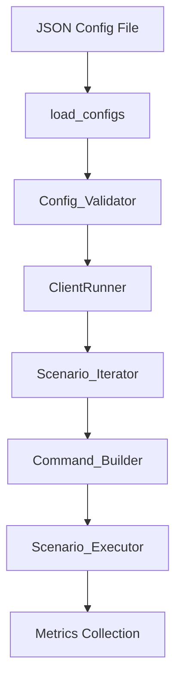

# Design Document: Unified Config Format

## Overview

This design removes the commands-based configuration format entirely, standardizing on `test_groups` as the only supported format. All existing commands-based config files are manually migrated to test_groups. The dual code paths for iteration, execution, and command building are consolidated into single paths that operate on the test_groups structure. The `uses_test_groups` flag is removed from the entire codebase.

## Architecture



The architecture is simplified by removing the format detection and normalization layer. Every config must be in test_groups format.

## Components and Interfaces

### 1. Config Validator (`benchmark.py::validate_config`)

Refactored to only handle the test_groups format. The commands-format validation branch and `REQUIRED_KEYS` constant are removed.

```python
def validate_config(cfg: dict) -> None:
    """Validate a unified config (must have test_groups).
    
    Raises ValueError with descriptive messages for any validation failure.
    """
```

**Validation checks:**
- `test_groups` must exist and be a non-empty list
- Each group must be a dict with a `scenarios` list (non-empty)
- Each scenario must have a non-empty, non-whitespace `command` string
- Each scenario must not have both `requests` and `duration`
- `clients` must be a positive integer if present
- `maxdocs` must be a positive integer if present
- `port` must be 1-65535 if present
- `cpu_allocation` and `server_cpu_range`/`client_cpu_range` are mutually exclusive
- `cluster_mode` can be bool or list of bools

**Removed:**
- `REQUIRED_KEYS` constant (was for commands format)
- `has_commands` / `has_test_groups` branching
- Commands-specific validation (keyspacelen, data_sizes, pipelines, clients as lists)

### 2. Updated `load_configs` Flow

```python
def load_configs(path: str) -> List[dict]:
    """Load and validate benchmark configurations."""
    with open(path) as fp:
        configs = json.load(fp)
    if not configs:
        raise ValueError("No configurations found in config file")
    for c in configs:
        validate_config(c)
    return configs
```

### 3. Scenario Iterator (`valkey_benchmark.py::ClientRunner._iterate_scenarios`)

Simplified to a single path that iterates over `test_groups`. The `_iterate_simple_scenarios` and `_iterate_test_groups_scenarios` methods are removed.

```python
def _iterate_scenarios(self):
    """Generate scenario execution data from test_groups config."""
    groups_to_run = self.config.get("groups_to_run")
    scenario_filter = self.config.get("scenario_filter")
    
    for test_group in self.config.get("test_groups", []):
        group_id = test_group.get("group", "unknown")
        if groups_to_run and group_id not in groups_to_run:
            continue
        for scenario in test_group.get("scenarios", []):
            for expanded in self._expand_scenario_options(scenario):
                if scenario_filter and expanded.get("id") not in scenario_filter:
                    continue
                for run_num in range(self.runs):
                    yield {
                        "scenario": expanded,
                        "group_id": group_id,
                        "run_num": run_num,
                        "config_set": self.current_config_set,
                        "config_suffix": self.config_suffix,
                    }
```

### 4. Command Builder (`valkey_benchmark.py::ClientRunner._build_benchmark_command`)

Refactored to always take a scenario dict. The `is_test_groups` branch is removed.

```python
def _build_benchmark_command(self, scenario: dict, *, warmup_mode: bool = False,
                              port: int = None, cpu_range: str = None) -> List[str]:
    """Build valkey-benchmark command from a scenario dict."""
```

**Key design decisions:**
- Always receives a scenario dict (no more positional args for simple format)
- Built-in commands (those in READ_COMMANDS + WRITE_COMMANDS with no spaces) use `-t command` flag
- Custom commands (containing spaces, like "FT.SEARCH idx ...") use `-- command_string`
- `data_size` from scenario uses `-d` flag (only for built-in commands)
- `benchmark_threads` from scenario uses `--threads` flag
- `keyspacelen` from scenario uses `-r` flag

### 5. Scenario Executor (`valkey_benchmark.py::ClientRunner._execute_scenario`)

Unified into a single method. The `_execute_simple_scenario` and `_execute_test_groups_scenario` methods are removed.

```python
def _execute_scenario(self, scenario_data, profiler, metrics_processor,
                       profiling_enabled, commit_time):
    """Execute a single scenario — unified path."""
```

**Consolidated behaviors:**
- `flush_before` handling
- `setup_commands` execution
- `auto_populate` handling (for migrated read-command scenarios)
- Warmup execution (per-scenario warmup value)
- Parallel execution for CME scenarios
- CSV parsing and metrics collection
- Failure marker creation on error

### 6. Removed Code

| Removed | Reason |
|---|---|
| `REQUIRED_KEYS` constant | Was for commands format validation |
| `uses_test_groups` parameter in `run_benchmark_matrix()` and `ClientRunner.__init__()` | No longer needed — single format |
| `_iterate_simple_scenarios()` | Merged into `_iterate_scenarios()` |
| `_iterate_test_groups_scenarios()` | Merged into `_iterate_scenarios()` |
| `_execute_simple_scenario()` | Merged into `_execute_scenario()` |
| `_execute_test_groups_scenario()` | Merged into `_execute_scenario()` |
| `_generate_combinations()` | No longer needed — no Cartesian product at runtime |
| Format detection in `main()` (`uses_test_groups = "test_groups" in config`) | All configs are test_groups |
| `has_commands` branch in `validate_config()` | Commands format no longer supported |

### 7. Config File Migration

All commands-based configs are manually converted to test_groups format. The migration follows this pattern:

**For each commands-based config:**
1. Take the Cartesian product of `commands × keyspacelen × data_sizes × pipelines × clients`
2. Create one scenario per combination
3. Set `duration` or `requests` from the original config
4. For read commands, add `auto_populate: true` and `populate_command`
5. Propagate `warmup`, `benchmark_threads`, `data_size`, `keyspacelen` to each scenario
6. Set `type` to "read" or "write" based on command
7. Generate deterministic IDs: `{command}_d{data_size}_p{pipeline}_c{clients}_k{keyspacelen}`

**Files to migrate:**
- `configs/benchmark-configs.json` — 13 commands × 1 keyspacelen × 1 data_size × 1 pipeline × 1 clients = 13 scenarios
- `configs/benchmark-config-arm.json` — 2 commands × 1 keyspacelen × 3 data_sizes × 2 pipelines × 1 clients = 12 scenarios
- `configs/benchmark-config-tag-arm.json` — 2 commands × 1 keyspacelen × 2 data_sizes × 2 pipelines × 1 clients = 8 scenarios
- `configs/benchmark-configs-cluster-tls.json` — 11 commands × 1 keyspacelen × 1 data_size × 1 pipeline × 1 clients = 11 scenarios

`configs/module-test-arm.json` is already in test_groups format — no changes needed.

## Data Models

### Unified Config Schema

```python
{
    # Required
    "test_groups": [
        {
            "group": 1,                          # Group identifier (int)
            "description": "...",                 # Optional description
            "scenarios": [
                {
                    "id": "set_d16_p10_c50",       # Unique scenario ID
                    "command": "SET",              # Valkey command or command string
                    "type": "write",               # "read" or "write"
                    "clients": 50,                 # Number of concurrent clients
                    "pipeline": 10,                # Pipeline depth
                    "data_size": 16,               # Payload size in bytes (built-in cmds)
                    "keyspacelen": 10000000,        # Key space length
                    
                    # Exactly one of:
                    "duration": 120,               # Duration mode (seconds)
                    # OR
                    "requests": 1000000,           # Requests mode (count)
                    
                    # Optional
                    "warmup": 10,                  # Warmup period (seconds)
                    "sequential": False,           # Sequential key access
                    "auto_populate": False,         # Auto-populate for read commands
                    "populate_command": "SET",      # Write command for population
                    "benchmark_threads": 2,         # Threads for valkey-benchmark
                    "flush_before": False,          # Flush DB before scenario
                    "setup_commands": [],           # Commands to run before benchmark
                    "dataset": "path/to/file.csv", # Dataset file path
                    "xml_root_element": "...",      # XML root element for dataset
                    "maxdocs": 1000,               # Max documents for write scenarios
                    "cluster_execution": "single",  # "single" or "parallel"
                    "parallel_clients": None,       # Custom parallel client count
                    "profiling": {},               # Per-scenario profiling overrides
                    "seed": True,                  # Enable/disable seed (default: true)
                    "options": {},                 # Scenario expansion options
                }
            ]
        }
    ],
    
    # Shared top-level fields (optional)
    "cluster_mode": False,          # bool or list of bools
    "tls_mode": False,              # bool
    "port": 6379,                   # int (1-65535)
    "io-threads": 2,                # int or list of ints
    "benchmark-threads": 2,         # int (global default)
    "warmup": 10,                   # int (global default, overridden by scenario)
    "seed": True,                   # bool (global seed control)
    "server_cpu_range": "0-3",      # CPU range string
    "client_cpu_range": "4-7",      # CPU range string
    "cpu_allocation": {},           # Alternative CPU config
    "cluster_nodes": 2,             # Number of cluster nodes
    "cluster_ports": [6379, 6380],  # Ports for cluster nodes
    "bind_ip": "127.0.0.1",        # Bind IP address
    "modules": [],                  # Module configurations
    "config_sets": [{}],            # Server config variations
    "profiling_sets": [{}],         # Profiling configurations
    "monitoring": {},               # Monitoring configuration
}
```

### Migrated Config Example

**Before (commands format):**
```json
{
    "duration": 120,
    "keyspacelen": [10000000],
    "data_sizes": [16],
    "pipelines": [10],
    "clients": [50],
    "commands": ["SET", "GET"],
    "cluster_mode": false,
    "tls_mode": false,
    "warmup": 10,
    "benchmark-threads": 2
}
```

**After (test_groups format):**
```json
{
    "test_groups": [
        {
            "group": 1,
            "description": "Standard Valkey benchmarks",
            "scenarios": [
                {
                    "id": "SET_d16_p10_c50_k10000000",
                    "command": "SET",
                    "type": "write",
                    "clients": 50,
                    "pipeline": 10,
                    "data_size": 16,
                    "keyspacelen": 10000000,
                    "duration": 120,
                    "warmup": 10,
                    "benchmark_threads": 2
                },
                {
                    "id": "GET_d16_p10_c50_k10000000",
                    "command": "GET",
                    "type": "read",
                    "clients": 50,
                    "pipeline": 10,
                    "data_size": 16,
                    "keyspacelen": 10000000,
                    "duration": 120,
                    "warmup": 10,
                    "benchmark_threads": 2,
                    "auto_populate": true,
                    "populate_command": "SET"
                }
            ]
        }
    ],
    "cluster_mode": false,
    "tls_mode": false,
    "benchmark-threads": 2
}
```


## Correctness Properties

*A property is a characteristic or behavior that should hold true across all valid executions of a system — essentially, a formal statement about what the system should do. Properties serve as the bridge between human-readable specifications and machine-verifiable correctness guarantees.*

### Property 1: Valid configs pass validation

*For any* randomly generated config with valid `test_groups` (non-empty list of groups, each with non-empty scenarios containing non-empty commands, and no conflicting fields like both `requests` and `duration`), `validate_config` SHALL return without raising an error.

**Validates: Requirements 3.9**

### Property 2: Group filtering

*For any* valid unified config with multiple test groups and a `groups_to_run` filter set, the Scenario_Iterator SHALL only yield scenarios from groups whose IDs are in the filter set. Specifically, every yielded scenario's group_id must be in `groups_to_run`.

**Validates: Requirements 4.2**

### Property 3: Scenario filtering

*For any* valid unified config with a `scenario_filter` set, the Scenario_Iterator SHALL only yield scenarios whose IDs are in the filter set. Specifically, every yielded scenario's ID must be in `scenario_filter`.

**Validates: Requirements 4.3**

### Property 4: Options expansion count

*For any* scenario dict with an `options` dict containing N entries (N > 0), `_expand_scenario_options` SHALL return exactly N variant scenarios. For scenarios with no options or empty options, it SHALL return exactly 1 scenario.

**Validates: Requirements 4.4**

### Property 5: Iterator produces at least one scenario

*For any* valid unified config (with non-empty test_groups containing non-empty scenarios and no filters applied), the Scenario_Iterator SHALL yield at least one scenario.

**Validates: Requirements 4.5**

### Property 6: Command builder flag correctness

*For any* scenario dict, the command built by `_build_benchmark_command` SHALL:
- contain `--duration` if and only if the scenario has `duration` set
- contain `-n` if and only if the scenario has `requests` set
- contain `--sequential` if and only if the scenario has `sequential: true`
- contain `--threads` if and only if the scenario has `benchmark_threads` set
- start with `taskset -c <range>` if and only if a `cpu_range` is provided
- contain `--tls` if and only if TLS mode is enabled

**Validates: Requirements 5.2, 5.3, 5.4, 5.5, 5.6, 5.7, 5.8**

### Property 7: Failure marker completeness

*For any* group_id, scenario_id, error message, command string, and timestamp, `_create_failure_marker` SHALL return a dict containing all of those values in the expected fields (`test_id`, `test_phase`, `status`, `error`, `command`, `timestamp`, `config_set`), with `status` always set to `"failed"`.

**Validates: Requirements 6.5**

## Error Handling

### Config Loading Errors

| Error Condition | Exception | Message Pattern |
|---|---|---|
| Empty JSON array | `ValueError` | "No configurations found in config file" |
| Missing `test_groups` | `ValueError` | "Config must have 'test_groups'" |
| Empty `test_groups` list | `ValueError` | "'test_groups' must be a non-empty list" |
| Group not a dict | `ValueError` | "test_groups[{i}] must be a dict" |
| Missing `scenarios` in group | `ValueError` | "test_groups[{i}] missing 'scenarios' field" |
| Empty `scenarios` list | `ValueError` | "test_groups[{i}].scenarios must be a non-empty list" |
| Missing `command` in scenario | `ValueError` | "test_groups[{i}].scenarios[{j}] missing 'command'" |
| Empty/whitespace command | `ValueError` | "Scenario command must be a non-empty string" |
| Both `requests` and `duration` | `ValueError` | "Scenario cannot specify both 'requests' and 'duration'" |
| Non-positive `clients` | `ValueError` | "'clients' must be a positive integer" |
| Non-positive `maxdocs` | `ValueError` | "'maxdocs' must be a positive integer" |
| Port out of range | `ValueError` | "'port' must be between 1 and 65535" |
| `cpu_allocation` + explicit ranges | `ValueError` | "Cannot use both cpu_allocation and server_cpu_range/client_cpu_range" |

### Runtime Errors

| Error Condition | Behavior |
|---|---|
| Dataset file not found | `FileNotFoundError` with missing path |
| Benchmark process non-zero exit | Log error, return failure marker dict |
| Server connection timeout | `RuntimeError` after timeout period |
| Setup command failure | `RuntimeError` with command details |

## Testing Strategy

### Framework and Libraries

- **pytest** — test runner and assertion framework (already in use)
- **hypothesis** — property-based testing library (already in use from test-suite-setup spec)

### Test Organization

New and modified test files:

| Test File | Purpose |
|---|---|
| `tests/test_benchmark_config.py` | Updated validation tests for unified format only |
| `tests/test_benchmark_command.py` | Updated command builder tests (scenario-based only) |
| `tests/test_scenario_iteration.py` | New: property + unit tests for unified iteration |
| `tests/test_config_migration.py` | New: tests that all migrated config files load and validate |
| `tests/conftest.py` | Updated fixtures for unified config format |

### Dual Testing Approach

**Property-based tests** (via Hypothesis, minimum 100 iterations each):
- Property 1: Valid configs pass validation
- Property 2: Group filtering
- Property 3: Scenario filtering
- Property 4: Options expansion count
- Property 5: Iterator produces at least one scenario
- Property 6: Command builder flag correctness
- Property 7: Failure marker completeness

**Unit tests** (specific examples and edge cases):
- Each validator error condition (Requirements 3.1-3.11, 7.1-7.2)
- All 5 migrated config files load and validate successfully
- Command builder output for built-in vs custom commands
- Scenario expansion with options (existing tests updated)
- Missing dataset file raises FileNotFoundError

### Property-Based Testing Configuration

- Library: **Hypothesis**
- Minimum iterations: 100 per property (via `@settings(max_examples=100)`)
- Each property test is a single test function implementing one design property
- Tag format: `# Feature: unified-config-format, Property N: <property_title>`

### Hypothesis Strategies

Custom strategies needed:

```python
# Generate valid unified configs
@st.composite
def valid_unified_configs(draw):
    num_groups = draw(st.integers(min_value=1, max_value=3))
    groups = []
    for g in range(num_groups):
        num_scenarios = draw(st.integers(min_value=1, max_value=5))
        scenarios = [draw(valid_scenario()) for _ in range(num_scenarios)]
        groups.append({"group": g + 1, "scenarios": scenarios})
    return {
        "test_groups": groups,
        "cluster_mode": draw(st.booleans()),
        "tls_mode": draw(st.booleans()),
    }

# Generate valid scenario dicts
@st.composite
def valid_scenario(draw):
    command = draw(st.text(min_size=1, max_size=30, 
                           alphabet=st.characters(whitelist_categories=('L', 'N', 'P', 'Z'))))
    clients = draw(st.integers(min_value=1, max_value=1000))
    use_duration = draw(st.booleans())
    scenario = {
        "id": draw(st.text(min_size=1, max_size=20, alphabet=string.ascii_lowercase + string.digits)),
        "command": command,
        "clients": clients,
    }
    if use_duration:
        scenario["duration"] = draw(st.integers(min_value=1, max_value=3600))
    else:
        scenario["requests"] = draw(st.integers(min_value=1, max_value=10_000_000))
    return scenario
```

### Test Dependencies

No new dependencies beyond what's already in the test suite:
```
pytest>=7.0
hypothesis>=6.0
```
